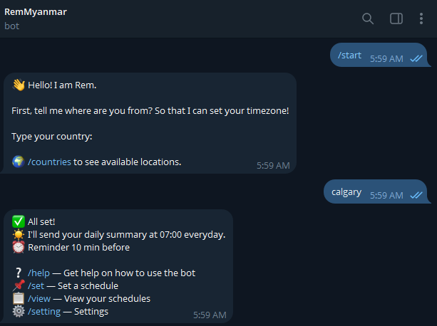
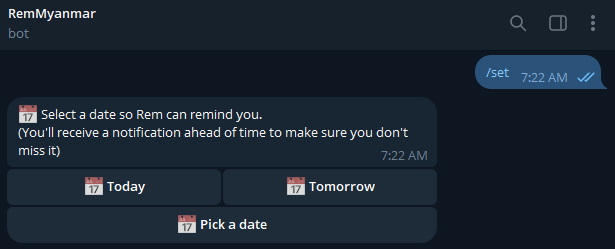
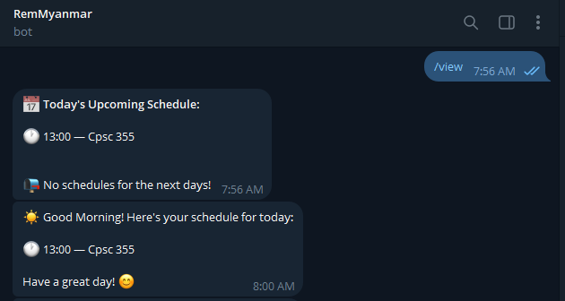
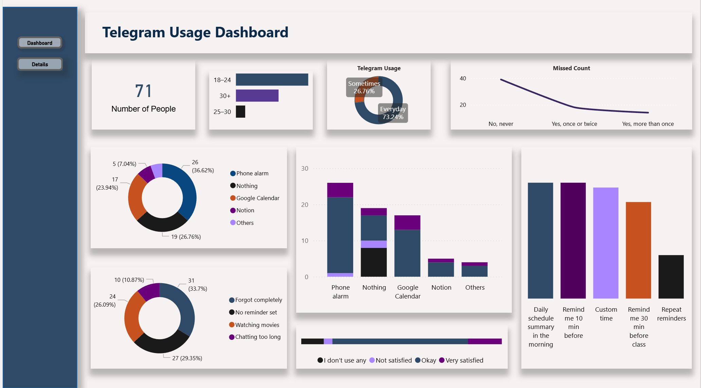

# 🤖 RemMyanmar — Telegram Reminder Bot

<p align="center">
  
</p>

<p align="center">
  A Telegram bot that helps users in Myanmar and Southeast Asia stay on top of their daily schedules - built after real user research showing that <strong>73% of Telegram users use it every day</strong>, and many miss classes or events while watching movies or chatting.
</p>

<p align="center">
  <a href="https://t.me/RemMyanmarbot">
    
  </a>
  
</p>

---

## 📊 Research Background

Before building the bot, a survey was conducted targeting **Myanmar Telegram users** to understand their usage habits and pain points.

🔗 **Survey (Myanmar only):** [View Survey](https://docs.google.com/forms/d/1SRfZ_2U3-znFYuBcm0hJh-R2qEZ5dZmnz_noWjYr0sg/edit)

**71 responses** were collected, cleaned and analyzed:
- Raw data collected via Google Forms 
- Data cleaned and processed in Excel 
- Visualized using Power BI dashboard 

| Finding | Result |
|---|---|
| Daily Telegram users | **73.24%** |
| Ever missed a class/event on Telegram | **Yes — majority** |
| #1 reason for missing | Forgot completely / No reminder set |
| Most wanted feature | Daily morning schedule summary |
| Current reminder method | Phone alarm (36.62%) or Nothing (26.76%) |

The data showed a clear gap — people needed a reminder tool that lived **inside Telegram** itself.

---

## ✨ Features

- 📅 **Set reminders** — pick date, time and add a description for anything
- 📋 **View schedule** — see today's and upcoming reminders sorted by time
- ☀️ **Morning summary** — daily schedule sent at your chosen time every day
- ⏰ **Custom reminder warning** — get notified 10–30 min before any event
- ✏️ **Edit reminders** — update description anytime
- 🗑️ **Delete reminders** — remove reminders easily
- 🌍 **Multi-timezone support** — works for users across multiple countries
- ❌ **Cancel anytime** — type `/cancel` to stop any ongoing action

---

## 📸 Screenshots

| Setup | Set Reminder | View Schedule |
|---|---|---|
|  |  |  |

---

## 📊 Survey Dashboard

Built with Power BI to visualize the research data collected before building the bot.



---

## 💬 Commands

| Command | Description |
|---|---|
| `/start` | Set up your timezone and preferences |
| `/set` | Add a new reminder |
| `/view` | View today's and upcoming schedule |
| `/edit` | Edit a reminder description |
| `/delete` | Delete a reminder |
| `/setting` | View settings menu |
| `/changemorning` | Change morning summary time |
| `/changereminder` | Change reminder warning time |
| `/countries` | See available locations |
| `/cancel` | Cancel any ongoing action |
| `/help` | Show help message |

---

## 🌍 Supported Locations

| Country | Keywords |
|---|---|
| 🇲🇲 Myanmar | myanmar, yangon, mandalay |
| 🇹🇭 Thailand | thailand, bangkok |
| 🇸🇬 Singapore | singapore |
| 🇲🇾 Malaysia | malaysia, kuala lumpur |
| 🇨🇦 Canada | canada, toronto, vancouver, calgary, montreal, edmonton, winnipeg |
| 🇺🇸 USA | usa, miami, new york, los angeles, chicago |
| 🇭🇺 Hungary | hungary, budapest |

---

## 🛠️ Tech Stack

| Tool | Purpose |
|---|---|
| Python 3.10+ | Main language |
| python-telegram-bot | Telegram bot framework |
| pytz | Timezone handling |
| python-dotenv | Secure token management |
| JSON | Local data storage |
| Power BI | Survey data dashboard |
| Google Forms | User research survey |

---

## 🚀 Run Locally

**1. Clone the repo:**
```bash
git clone https://github.com/yourusername/telegrambot.git
cd telegrambot
```

**2. Install dependencies:**
```bash
pip install -r requirements.txt
```

**3. Create a `.env` file:**

Get your own Telegram token from BotFather. More on that [here](https://core.telegram.org/bots).
```
TOKEN=your_telegram_bot_token_here
```

**4. Run the bot:**
```bash
python rem.py
```

---

## 📁 Project Structure

```
telegrambot/
├── rem.py                          # Main bot logic
├── keyboards.py                    # Inline keyboard layouts
├── timezones.py                    # Timezone mapping
├── msg.py                          # Bot messages and text
├── requirements.txt                # Python dependencies
├── Procfile                        # Deployment config
├── .gitignore                      # Excludes .env and rems.json
├── data/
│   ├── Telegram_Usage_Survey_raw.csv   # Raw survey responses
│   └── cleaned_Rem_English.xlsx        # Cleaned and processed data
└── dashboard/
    └── Dashboard.pbix              # Power BI dashboard file
```

---

## 📬 Try the Bot

👉 Search **@RemMyanmarbot** on Telegram or click [here](https://t.me/RemMyanmarbot)


